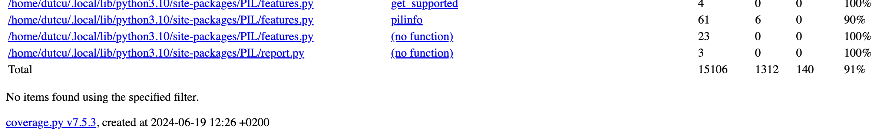
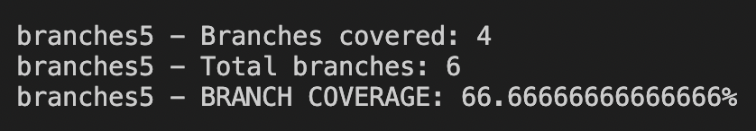
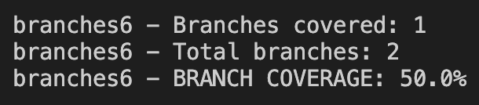
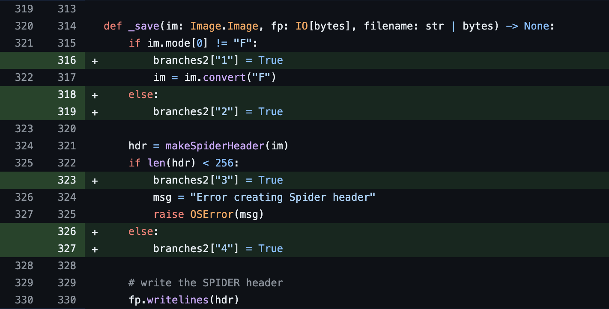
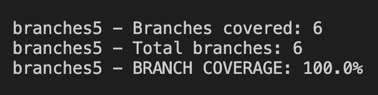
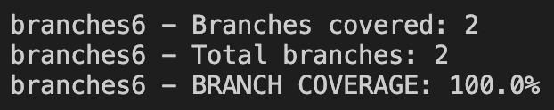
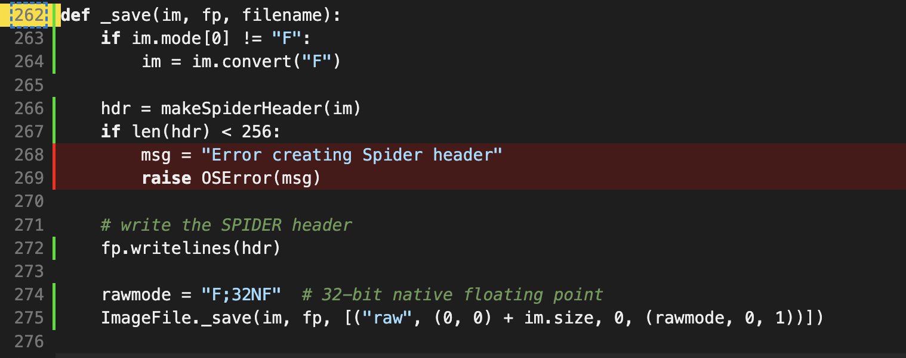
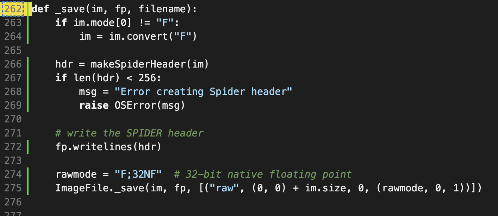
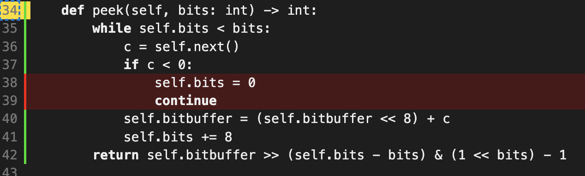
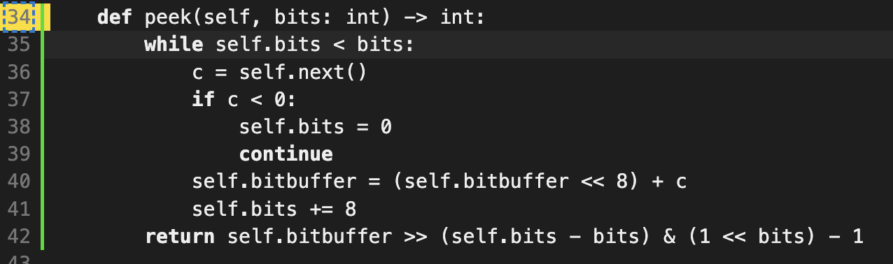

# Report for Assignment 1

## Project chosen

Name: Pillow

URL of our repository: https://github.com/jovanovicisidora/Pillow-SEP.git

URL of the original repo: https://github.com/python-pillow/Pillow.git

Number of lines of code and the tool used to count it:
- Tool used: coverage.py
- Number of lines of code: 82 KLOC

Programming language: Python

## Coverage measurement

### Existing tool

<Inform the name of the existing tool that was executed and how it was executed>

<Show the coverage results provided by the existing tool with a screenshot>

We used Coverage.py. We executed the coverage tool by running the following command:

`python3 -bb -m pytest -v -x -W always --cov PIL --cov Tests --cov-report term Tests $REVERSE`

This resulted in the following output:

### Your own coverage tool

<The following is supposed to be repeated for each group member>

<Group member name>

<Function 1 name>

<Show a patch (diff) or a link to a commit made in your forked repository that shows the instrumented code to gather
coverage measurements>

<Provide a screenshot of the coverage results output by the instrumentation>

<Function 2 name>

<Provide the same kind of information provided for Function 1>

Each member of out group has chosen two functions and has instrumented our own coverage tool. For each function we
created a dictionary with the branch ID as key, and a boolean as the value. If the branch was accessed by the tests,
the boolean value would be changed from False to True. In order to calculate and display the coverage, all tests use
the shared code in **conftest.py**.

**1. Deekshu**

- Function 1: `buildTransform()` from **ImageCms.py**

    [Link to the commit](https://github.com/jovanovicisidora/Pillow-SEP/commit/b235d0e1c19c64870155094e98477ea9377655f2#diff-bd1e1b1de6e5b72a2a01d9d5ea74efe89541f209db5b30c16b975af71e308c67)

    

- Function 2: `encode_to_file` from **ImageFile.py**

    [Link to the commit](https://github.com/python-pillow/Pillow/commit/4f31cd7a31a6be2ac38773bab6f0a5451480f5b8#diff-4668a28f508bbcb68e61f9b257415dc814c22e8bb24850629fe7788ae5b7475c)

    

**2. Duru**

**3. Isidora**

- Function 1: `_save()` from **SpiderImagePlugin.py**

    [Link to the commit](https://github.com/jovanovicisidora/Pillow-SEP/commit/5701d33cbb789342ca781769d4ba7cd323c9255e#diff-44debbfd4d0c5a80130a15bdcd9e0b28c1b4fef6eda0eaaef48838c954589d15)

    

- Function 2: `Bitstream.peek()` from **MpegImagePlugin.py**

    [Link to the commit](https://github.com/jovanovicisidora/Pillow-SEP/commit/70f6735620d2f8e469cbe5b60a4586c5db95624a#diff-0272f0c6b5871be3364fe2062e50944fba30dad9625c74d13340de7d3ad8d367)

    

**4. Sofija**

## Coverage improvement

### Individual tests

<The following is supposed to be repeated for each group member>

<Group member name>

<Test 1>

<Show a patch (diff) or a link to a commit made in your forked repository that shows the new/enhanced test>

<Provide a screenshot of the old coverage results (the same as you already showed above)>

<Provide a screenshot of the new coverage results>

<State the coverage improvement with a number and elaborate on why the coverage is improved>

<Test 2>

<Provide the same kind of information provided for Test 1>

**1. Deekshu**

- Function 1: `buildTransform()` from **ImageCms.py**

    [Link to the commit](https://github.com/jovanovicisidora/Pillow-SEP/commit/52965eed2de5ca44eeb6c6dfb1f11778d369c6f7)

    

    

- Function 2: `encode_to_file` from **ImageFile.py**

    [Link to the commit](https://github.com/python-pillow/Pillow/commit/e39e422ca66b8cc8fbe4dbaceffa624af05f0088)

    

    

**2. Duru**

**3. Isidora**

- Function 1: `_save()` from **SpiderImagePlugin.py**

    [Link to the commit](https://github.com/jovanovicisidora/Pillow-SEP/commit/70f6735620d2f8e469cbe5b60a4586c5db95624a#diff-f0eb82b90cfc005f681c774b3bf87f19b1db010750e49f850883005f4f623202)

    

    

- Function 2: `Bitstream.peek()` from **MpegImagePlugin.py**

    [Link to the commit](https://github.com/jovanovicisidora/Pillow-SEP/commit/70f6735620d2f8e469cbe5b60a4586c5db95624a#diff-48e5b5451c5cab3fbb758ae58649082b62ae6f2850393a332949643d75bd4ad2)

    

    

**4. Sofija**

### Overall

First we provide a screenshot of the old coverage results by running an existing tool:

Here we show the improved overall coverage with all test modifications made by out group:

## Statement of individual contributions

Each group member had an equal contribution to the assignment. We first met together to determine
how we can make a coverage tool that can be used across all functions (in conftest.py). Then, each
member chose two functions to instrument our coverage tool on and to make/enhance tests for their branch improvement.
The specific functions each member chose can be seen in the report above.
