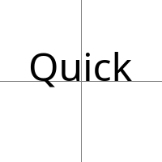
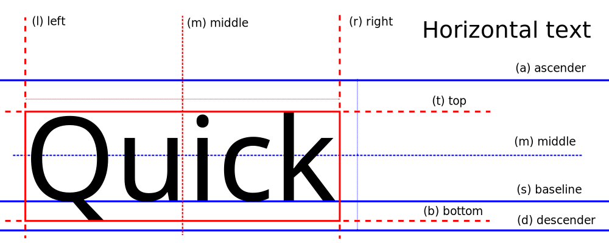
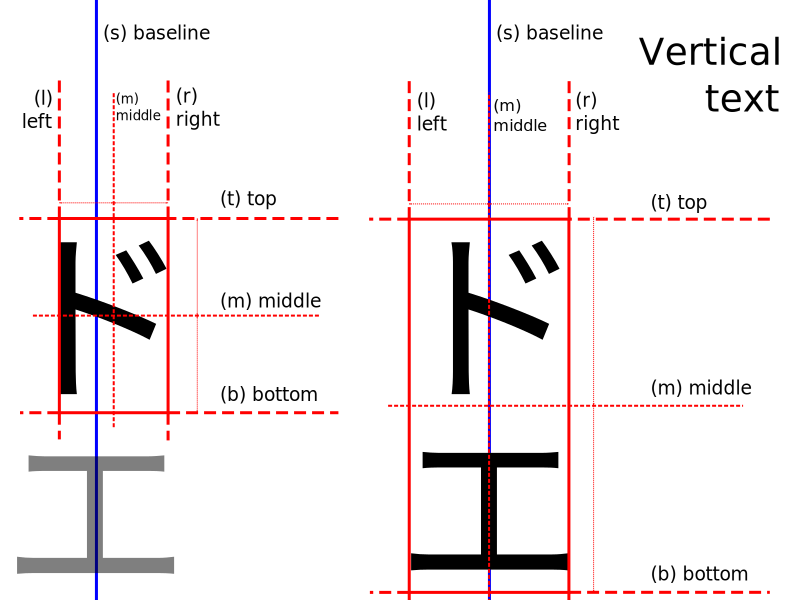
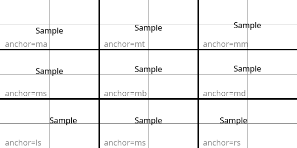

.. _text-anchors:

Text anchors
============

The ``anchor`` parameter determines the alignment of drawn text relative to the ``xy`` parameter.
The default alignment is top left, specifically ``la`` (left-ascender) for horizontal text
and ``lt`` (left-top) for vertical text.

This parameter is only supported by OpenType/TrueType fonts.
Other fonts may ignore the parameter and use the default (top left) alignment.

Specifying an anchor
^^^^^^^^^^^^^^^^^^^^

An anchor is specified with a two-character string. The first character is the
horizontal alignment, the second character is the vertical alignment.
For example, the default value of ``la`` for horizontal text means left-ascender
aligned text.

When drawing text with :py:meth:`PIL.ImageDraw.ImageDraw.text` with a specific anchor,
the text will be placed such that the specified anchor point is at the ``xy`` coordinates.

For example, in the following image, the text is ``ms`` (middle-baseline) aligned, with
``xy`` at the intersection of the two lines:

.. code-block:: python

    from PIL import Image, ImageDraw, ImageFont

    font = ImageFont.truetype("Tests/fonts/NotoSans-Regular.ttf", 48)
    im = Image.new("RGB", (200, 200), "white")
    d = ImageDraw.Draw(im)
    d.line(((0, 100), (200, 100)), "gray")
    d.line(((100, 0), (100, 200)), "gray")
    d.text((100, 100), "Quick", fill="black", anchor="ms", font=font)

.. container:: clearer

    |

.. only: comment
    The container above prevents the image alignment from affecting the following text.

Quick reference
^^^^^^^^^^^^^^^

Horizontal anchor alignment
^^^^^^^^^^^^^^^^^^^^^^^^^^^

``l`` --- left
    Anchor is to the left of the text.

    For *horizontal* text this is the origin of the first glyph, as shown in the `FreeType tutorial`_.

``m`` --- middle
    Anchor is horizontally centered with the text.

    For *vertical* text it is recommended to use ``s`` (baseline) alignment instead,
    as it does not change based on the specific glyphs of the given text.

``r`` --- right
    Anchor is to the right of the text.

    For *horizontal* text this is the advanced origin of the last glyph, as shown in the `FreeType tutorial`_.

``s`` --- baseline *(vertical text only)*
    Anchor is at the baseline (middle) of the text. The exact alignment depends on the font.

    For *vertical* text this is the recommended alignment,
    as it does not change based on the specific glyphs of the given text
    (see image for vertical text above).

Vertical anchor alignment
^^^^^^^^^^^^^^^^^^^^^^^^^

``a`` --- ascender / top *(horizontal text only)*
    Anchor is at the ascender line (top) of the first line of text, as defined by the font.

    See `Font metrics on Wikipedia`_ for more information.

``t`` --- top *(single-line text only)*
    Anchor is at the top of the text.

    For *vertical* text this is the origin of the first glyph, as shown in the `FreeType tutorial`_.

    For *horizontal* text it is recommended to use ``a`` (ascender) alignment instead,
    as it does not change based on the specific glyphs of the given text.

``m`` --- middle
    Anchor is vertically centered with the text.

    For *horizontal* text this is the midpoint of the first ascender line and the last descender line.

``s`` --- baseline *(horizontal text only)*
    Anchor is at the baseline (bottom) of the first line of text, only descenders extend below the anchor.

    See `Font metrics on Wikipedia`_ for more information.

``b`` --- bottom *(single-line text only)*
    Anchor is at the bottom of the text.

    For *vertical* text this is the advanced origin of the last glyph, as shown in the `FreeType tutorial`_.

    For *horizontal* text it is recommended to use ``d`` (descender) alignment instead,
    as it does not change based on the specific glyphs of the given text.

``d`` --- descender / bottom *(horizontal text only)*
    Anchor is at the descender line (bottom) of the last line of text, as defined by the font.

    See `Font metrics on Wikipedia`_ for more information.

Examples
^^^^^^^^

The following image shows several examples of anchors for horizontal text.
In each section the ``xy`` parameter was set to the center shown by the intersection
of the two lines.

.. comment: Image generated with ../example/anchors.py

.. _Font metrics on Wikipedia: https://en.wikipedia.org/wiki/Typeface#Font_metrics
.. _FreeType tutorial: https://freetype.org/freetype2/docs/tutorial/step2.html
