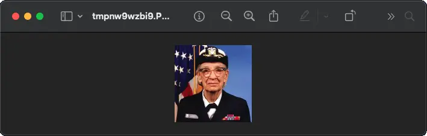
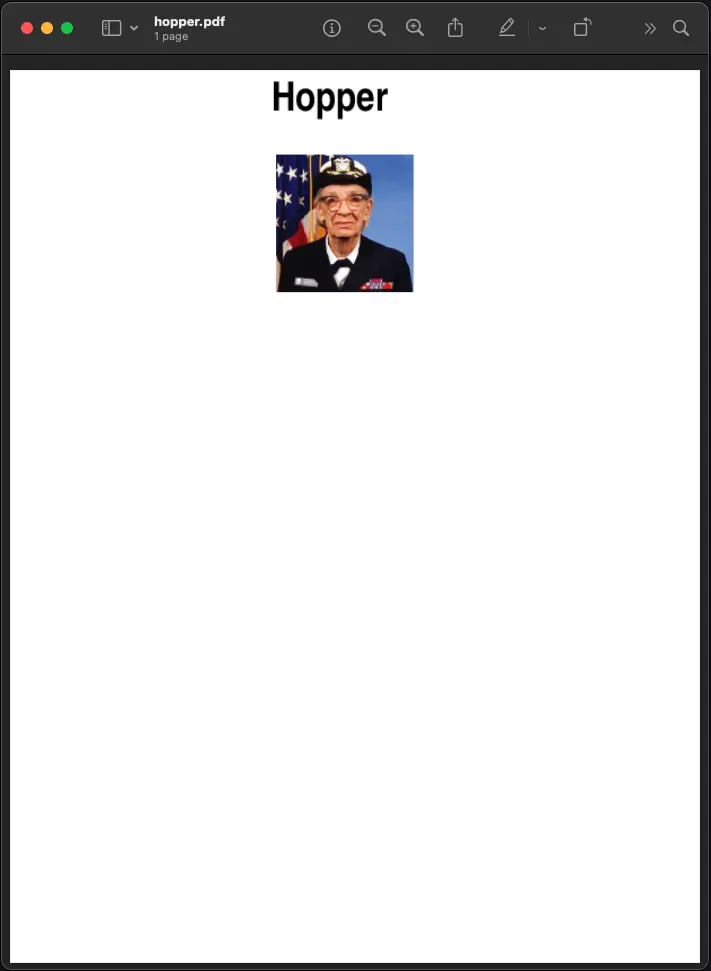

Tutorial
========

Using the Image class
---------------------

The most important class in the Python Imaging Library is the
:py:class:`~PIL.Image.Image` class, defined in the module with the same name.
You can create instances of this class in several ways; either by loading
images from files, processing other images, or creating images from scratch.

To load an image from a file, use the :py:func:`~PIL.Image.open` function
in the :py:mod:`~PIL.Image` module::

    >>> from PIL import Image
    >>> im = Image.open("hopper.ppm")

If successful, this function returns an :py:class:`~PIL.Image.Image` object.
You can now use instance attributes to examine the file contents::

    >>> print(im.format, im.size, im.mode)
    PPM (512, 512) RGB

The :py:attr:`~PIL.Image.Image.format` attribute identifies the source of an
image. If the image was not read from a file, it is set to None. The size
attribute is a 2-tuple containing width and height (in pixels). The
:py:attr:`~PIL.Image.Image.mode` attribute defines the number and names of the
bands in the image, and also the pixel type and depth. Common modes are “L”
(luminance) for grayscale images, “RGB” for true color images, and “CMYK” for
pre-press images.

If the file cannot be opened, an :py:exc:`OSError` exception is raised.

Once you have an instance of the :py:class:`~PIL.Image.Image` class, you can use
the methods defined by this class to process and manipulate the image. For
example, let’s display the image we just loaded::

    >>> im.show()

.. note::

    The standard version of :py:meth:`~PIL.Image.Image.show` is not very
    efficient, since it saves the image to a temporary file and calls a utility
    to display the image. If you don’t have an appropriate utility installed,
    it won’t even work. When it does work though, it is very handy for
    debugging and tests.

The following sections provide an overview of the different functions provided in this library.

Reading and writing images
--------------------------

The Python Imaging Library supports a wide variety of image file formats. To
read files from disk, use the :py:func:`~PIL.Image.open` function in the
:py:mod:`~PIL.Image` module. You don’t have to know the file format to open a
file. The library automatically determines the format based on the contents of
the file.

To save a file, use the :py:meth:`~PIL.Image.Image.save` method of the
:py:class:`~PIL.Image.Image` class. When saving files, the name becomes
important. Unless you specify the format, the library uses the filename
extension to discover which file storage format to use.

Convert files to JPEG
^^^^^^^^^^^^^^^^^^^^^

::

    import os, sys
    from PIL import Image

    for infile in sys.argv[1:]:
        f, e = os.path.splitext(infile)
        outfile = f + ".jpg"
        if infile != outfile:
            try:
                with Image.open(infile) as im:
                    im.save(outfile)
            except OSError:
                print("cannot convert", infile)

.. image:: ../../Tests/images/hopper.jpg
    :align: center

A second argument can be supplied to the :py:meth:`~PIL.Image.Image.save`
method which explicitly specifies a file format. If you use a non-standard
extension, you must always specify the format this way:

Create JPEG thumbnails
^^^^^^^^^^^^^^^^^^^^^^

::

    import os, sys
    from PIL import Image

    size = (128, 128)

    for infile in sys.argv[1:]:
        outfile = os.path.splitext(infile)[0] + ".thumbnail"
        if infile != outfile:
            try:
                with Image.open(infile) as im:
                    im.thumbnail(size)
                    im.save(outfile, "JPEG")
            except OSError:
                print("cannot create thumbnail for", infile)

It is important to note that the library doesn’t decode or load the raster data
unless it really has to. When you open a file, the file header is read to
determine the file format and extract things like mode, size, and other
properties required to decode the file, but the rest of the file is not
processed until later.

This means that opening an image file is a fast operation, which is independent
of the file size and compression type. Here’s a simple script to quickly
identify a set of image files:

Identify image files
^^^^^^^^^^^^^^^^^^^^

::

    import sys
    from PIL import Image

    for infile in sys.argv[1:]:
        try:
            with Image.open(infile) as im:
                print(infile, im.format, f"{im.size}x{im.mode}")
        except OSError:
            pass

Cutting, pasting, and merging images
------------------------------------

The :py:class:`~PIL.Image.Image` class contains methods allowing you to
manipulate regions within an image. To extract a sub-rectangle from an image,
use the :py:meth:`~PIL.Image.Image.crop` method.

Copying a subrectangle from an image
^^^^^^^^^^^^^^^^^^^^^^^^^^^^^^^^^^^^

::

    box = (0, 0, 64, 64)
    region = im.crop(box)

The region is defined by a 4-tuple, where coordinates are (left, upper, right,
lower). The Python Imaging Library uses a coordinate system with (0, 0) in the
upper left corner. Also note that coordinates refer to positions between the
pixels, so the region in the above example is exactly 64x64 pixels.

The region could now be processed in a certain manner and pasted back.

Processing a subrectangle, and pasting it back
^^^^^^^^^^^^^^^^^^^^^^^^^^^^^^^^^^^^^^^^^^^^^^

::

    region = region.transpose(Image.Transpose.ROTATE_180)
    im.paste(region, box)

When pasting regions back, the size of the region must match the given region
exactly. In addition, the region cannot extend outside the image. However, the
modes of the original image and the region do not need to match. If they don’t,
the region is automatically converted before being pasted (see the section on
:ref:`color-transforms` below for details).

Here’s an additional example:

Rolling an image
^^^^^^^^^^^^^^^^

::

    def roll(im: Image.Image, delta: int) -> Image.Image:
        """Roll an image sideways."""
        xsize, ysize = im.size

        delta = delta % xsize
        if delta == 0:
            return im

        part1 = im.crop((0, 0, delta, ysize))
        part2 = im.crop((delta, 0, xsize, ysize))
        im.paste(part1, (xsize - delta, 0, xsize, ysize))
        im.paste(part2, (0, 0, xsize - delta, ysize))

        return im

Or if you would like to merge two images into a wider image:

Merging images
^^^^^^^^^^^^^^

::

    def merge(im1: Image.Image, im2: Image.Image) -> Image.Image:
        w = im1.size[0] + im2.size[0]
        h = max(im1.size[1], im2.size[1])
        im = Image.new("RGBA", (w, h))

        im.paste(im1)
        im.paste(im2, (im1.size[0], 0))

        return im

For more advanced tricks, the paste method can also take a transparency mask as
an optional argument. In this mask, the value 255 indicates that the pasted
image is opaque in that position (that is, the pasted image should be used as
is). The value 0 means that the pasted image is completely transparent. Values
in-between indicate different levels of transparency. For example, pasting an
RGBA image and also using it as the mask would paste the opaque portion
of the image but not its transparent background.

The Python Imaging Library also allows you to work with the individual bands of
an multi-band image, such as an RGB image. The split method creates a set of
new images, each containing one band from the original multi-band image. The
merge function takes a mode and a tuple of images, and combines them into a new
image. The following sample swaps the three bands of an RGB image:

Splitting and merging bands
^^^^^^^^^^^^^^^^^^^^^^^^^^^

::

    r, g, b = im.split()
    im = Image.merge("RGB", (b, g, r))

Note that for a single-band image, :py:meth:`~PIL.Image.Image.split` returns
the image itself. To work with individual color bands, you may want to convert
the image to “RGB” first.

Geometrical transforms
----------------------

The :py:class:`PIL.Image.Image` class contains methods to
:py:meth:`~PIL.Image.Image.resize` and :py:meth:`~PIL.Image.Image.rotate` an
image. The former takes a tuple giving the new size, the latter the angle in
degrees counter-clockwise.

Simple geometry transforms
^^^^^^^^^^^^^^^^^^^^^^^^^^

::

    out = im.resize((128, 128))
    out = im.rotate(45) # degrees counter-clockwise

To rotate the image in 90 degree steps, you can either use the
:py:meth:`~PIL.Image.Image.rotate` method or the
:py:meth:`~PIL.Image.Image.transpose` method. The latter can also be used to
flip an image around its horizontal or vertical axis.

Transposing an image
^^^^^^^^^^^^^^^^^^^^

::

    out = im.transpose(Image.Transpose.FLIP_LEFT_RIGHT)

::

    out = im.transpose(Image.Transpose.FLIP_TOP_BOTTOM)

::

    out = im.transpose(Image.Transpose.ROTATE_90)

::

    out = im.transpose(Image.Transpose.ROTATE_180)

::

    out = im.transpose(Image.Transpose.ROTATE_270)

``transpose(ROTATE)`` operations can also be performed identically with
:py:meth:`~PIL.Image.Image.rotate` operations, provided the ``expand`` flag is
true, to provide for the same changes to the image's size.

A more general form of image transformations can be carried out via the
:py:meth:`~PIL.Image.Image.transform` method.

Relative resizing
^^^^^^^^^^^^^^^^^

Instead of calculating the size of the new image when resizing, you can also
choose to resize relative to a given size.

::

    from PIL import Image, ImageOps
    size = (100, 150)
    with Image.open("hopper.webp") as im:
        ImageOps.contain(im, size).save("imageops_contain.webp")
        ImageOps.cover(im, size).save("imageops_cover.webp")
        ImageOps.fit(im, size).save("imageops_fit.webp")
        ImageOps.pad(im, size, color="#f00").save("imageops_pad.webp")

        # thumbnail() can also be used,
        # but will modify the image object in place
        im.thumbnail(size)
        im.save("image_thumbnail.webp")

+----------------+--------------------------------------------+---------------------------------------------+-------------------------------------------+-----------------------------------------+-----------------------------------------+
|                | :py:meth:`~PIL.Image.Image.thumbnail`      | :py:meth:`~PIL.ImageOps.contain`            | :py:meth:`~PIL.ImageOps.cover`            | :py:meth:`~PIL.ImageOps.fit`            | :py:meth:`~PIL.ImageOps.pad`            |
+================+============================================+=============================================+===========================================+=========================================+=========================================+
|Given size      | ``(100, 150)``                             | ``(100, 150)``                              | ``(100, 150)``                            | ``(100, 150)``                          | ``(100, 150)``                          |
+----------------+--------------------------------------------+---------------------------------------------+-------------------------------------------+-----------------------------------------+-----------------------------------------+
|Resulting image | .. image:: ../example/image_thumbnail.webp | .. image:: ../example/imageops_contain.webp | .. image:: ../example/imageops_cover.webp | .. image:: ../example/imageops_fit.webp | .. image:: ../example/imageops_pad.webp |
+----------------+--------------------------------------------+---------------------------------------------+-------------------------------------------+-----------------------------------------+-----------------------------------------+
|Resulting size  | ``100×100``                                | ``100×100``                                 | ``150×150``                               | ``100×150``                             | ``100×150``                             |
+----------------+--------------------------------------------+---------------------------------------------+-------------------------------------------+-----------------------------------------+-----------------------------------------+

.. _color-transforms:

Color transforms
----------------

The Python Imaging Library allows you to convert images between different pixel
representations using the :py:meth:`~PIL.Image.Image.convert` method.

Converting between modes
^^^^^^^^^^^^^^^^^^^^^^^^

::

    from PIL import Image

    with Image.open("hopper.ppm") as im:
        im = im.convert("L")

The library supports transformations between each supported mode and the “L”
and “RGB” modes. To convert between other modes, you may have to use an
intermediate image (typically an “RGB” image).

Image enhancement
-----------------

The Python Imaging Library provides a number of methods and modules that can be
used to enhance images.

Filters
^^^^^^^

The :py:mod:`~PIL.ImageFilter` module contains a number of pre-defined
enhancement filters that can be used with the
:py:meth:`~PIL.Image.Image.filter` method.

Applying filters
~~~~~~~~~~~~~~~~

::

    from PIL import ImageFilter
    out = im.filter(ImageFilter.DETAIL)

Point operations
^^^^^^^^^^^^^^^^

The :py:meth:`~PIL.Image.Image.point` method can be used to translate the pixel
values of an image (e.g. image contrast manipulation). In most cases, a
function object expecting one argument can be passed to this method. Each
pixel is processed according to that function:

Applying point transforms
~~~~~~~~~~~~~~~~~~~~~~~~~

::

    # multiply each pixel by 20
    out = im.point(lambda i: i * 20)

Using the above technique, you can quickly apply any simple expression to an
image. You can also combine the :py:meth:`~PIL.Image.Image.point` and
:py:meth:`~PIL.Image.Image.paste` methods to selectively modify an image:

Processing individual bands
~~~~~~~~~~~~~~~~~~~~~~~~~~~

::

    # split the image into individual bands
    source = im.split()

    R, G, B = 0, 1, 2

    # select regions where red is less than 100
    mask = source[R].point(lambda i: i < 100 and 255)

    # process the green band
    out = source[G].point(lambda i: i * 0.7)

    # paste the processed band back, but only where red was < 100
    source[G].paste(out, None, mask)

    # build a new multiband image
    im = Image.merge(im.mode, source)

Note the syntax used to create the mask::

    imout = im.point(lambda i: expression and 255)

Python only evaluates the portion of a logical expression as is necessary to
determine the outcome, and returns the last value examined as the result of the
expression. So if the expression above is false (0), Python does not look at
the second operand, and thus returns 0. Otherwise, it returns 255.

Enhancement
^^^^^^^^^^^

For more advanced image enhancement, you can use the classes in the
:py:mod:`~PIL.ImageEnhance` module. Once created from an image, an enhancement
object can be used to quickly try out different settings.

You can adjust contrast, brightness, color balance and sharpness in this way.

Enhancing images
~~~~~~~~~~~~~~~~

::

    from PIL import ImageEnhance

    enh = ImageEnhance.Contrast(im)
    enh.enhance(1.3).show("30% more contrast")

Image sequences
---------------

The Python Imaging Library contains some basic support for image sequences
(also called animation formats). Supported sequence formats include FLI/FLC,
GIF, and a few experimental formats. TIFF files can also contain more than one
frame.

When you open a sequence file, PIL automatically loads the first frame in the
sequence. You can use the seek and tell methods to move between different
frames:

Reading sequences
^^^^^^^^^^^^^^^^^

::

    from PIL import Image

    with Image.open("animation.gif") as im:
        im.seek(1)  # skip to the second frame

        try:
            while 1:
                im.seek(im.tell() + 1)
                # do something to im
        except EOFError:
            pass  # end of sequence

As seen in this example, you’ll get an :py:exc:`EOFError` exception when the
sequence ends.

Writing sequences
^^^^^^^^^^^^^^^^^

You can create animated GIFs with Pillow, e.g.

::

    from PIL import Image

    # List of image filenames
    image_filenames = [
        "hopper.jpg",
        "rotated_hopper_270.jpg",
        "rotated_hopper_180.jpg",
        "rotated_hopper_90.jpg",
    ]

    # Open images and create a list
    images = [Image.open(filename) for filename in image_filenames]

    # Save the images as an animated GIF
    images[0].save(
        "animated_hopper.gif",
        append_images=images[1:],
        duration=500,  # duration of each frame in milliseconds
        loop=0,  # loop forever
    )

The following class lets you use the for-statement to loop over the sequence:

Using the :py:class:`~PIL.ImageSequence.Iterator` class
^^^^^^^^^^^^^^^^^^^^^^^^^^^^^^^^^^^^^^^^^^^^^^^^^^^^^^^

::

    from PIL import ImageSequence
    for frame in ImageSequence.Iterator(im):
        # ...do something to frame...

PostScript printing
-------------------

The Python Imaging Library includes functions to print images, text and
graphics on PostScript printers. Here’s a simple example:

Drawing PostScript
^^^^^^^^^^^^^^^^^^

::

    from PIL import Image, PSDraw
    import os

    # Define the PostScript file
    ps_file = open("hopper.ps", "wb")

    # Create a PSDraw object
    ps = PSDraw.PSDraw(ps_file)

    # Start the document
    ps.begin_document()

    # Set the text to be drawn
    text = "Hopper"

    # Define the PostScript font
    font_name = "Helvetica-Narrow-Bold"
    font_size = 36

    # Calculate text size (approximation as PSDraw doesn't provide direct method)
    # Assuming average character width as 0.6 of the font size
    text_width = len(text) * font_size * 0.6
    text_height = font_size

    # Set the position (top-center)
    page_width, page_height = 595, 842  # A4 size in points
    text_x = (page_width - text_width) // 2
    text_y = page_height - text_height - 50  # Distance from the top of the page

    # Load the image
    image_path = "hopper.ppm"  # Update this with your image path
    with Image.open(image_path) as im:
        # Resize the image if it's too large
        im.thumbnail((page_width - 100, page_height // 2))

        # Define the box where the image will be placed
        img_x = (page_width - im.width) // 2
        img_y = text_y + text_height - 200  # 200 points below the text

        # Draw the image (75 dpi)
        ps.image((img_x, img_y, img_x + im.width, img_y + im.height), im, 75)

    # Draw the text
    ps.setfont(font_name, font_size)
    ps.text((text_x, text_y), text)

    # End the document
    ps.end_document()
    ps_file.close()

.. note::

    PostScript converted to PDF for display purposes

More on reading images
----------------------

As described earlier, the :py:func:`~PIL.Image.open` function of the
:py:mod:`~PIL.Image` module is used to open an image file. In most cases, you
simply pass it the filename as an argument. ``Image.open()`` can be used as a
context manager::

    from PIL import Image
    with Image.open("hopper.ppm") as im:
        ...

If everything goes well, the result is an :py:class:`PIL.Image.Image` object.
Otherwise, an :exc:`OSError` exception is raised.

You can use a file-like object instead of the filename. The object must
implement ``file.read``, ``file.seek`` and ``file.tell`` methods,
and be opened in binary mode.

Reading from an open file
^^^^^^^^^^^^^^^^^^^^^^^^^

::

    from PIL import Image

    with open("hopper.ppm", "rb") as fp:
        im = Image.open(fp)

To read an image from binary data, use the :py:class:`~io.BytesIO`
class:

Reading from binary data
^^^^^^^^^^^^^^^^^^^^^^^^

::

    from PIL import Image
    import io

    im = Image.open(io.BytesIO(buffer))

Note that the library rewinds the file (using ``seek(0)``) before reading the
image header. In addition, seek will also be used when the image data is read
(by the load method). If the image file is embedded in a larger file, such as a
tar file, you can use the :py:class:`~PIL.ContainerIO` or
:py:class:`~PIL.TarIO` modules to access it.

Reading from URL
^^^^^^^^^^^^^^^^

::

    from PIL import Image
    from urllib.request import urlopen
    url = "https://python-pillow.github.io/assets/images/pillow-logo.png"
    img = Image.open(urlopen(url))

Reading from a tar archive
^^^^^^^^^^^^^^^^^^^^^^^^^^

::

    from PIL import Image, TarIO

    fp = TarIO.TarIO("hopper.tar", "hopper.jpg")
    im = Image.open(fp)

Batch processing
^^^^^^^^^^^^^^^^

Operations can be applied to multiple image files. For example, all PNG images
in the current directory can be saved as JPEGs at reduced quality.

::

    import glob
    from PIL import Image

    def compress_image(source_path: str, dest_path: str) -> None:
        with Image.open(source_path) as img:
            if img.mode != "RGB":
                img = img.convert("RGB")
            img.save(dest_path, "JPEG", optimize=True, quality=80)

    paths = glob.glob("*.png")
    for path in paths:
        compress_image(path, path[:-4] + ".jpg")

Since images can also be opened from a ``Path`` from the ``pathlib`` module,
the example could be modified to use ``pathlib`` instead of the ``glob``
module.

::

    from pathlib import Path

    paths = Path(".").glob("*.png")
    for path in paths:
        compress_image(path, path.stem + ".jpg")

Controlling the decoder
-----------------------

Some decoders allow you to manipulate the image while reading it from a file.
This can often be used to speed up decoding when creating thumbnails (when
speed is usually more important than quality) and printing to a monochrome
laser printer (when only a grayscale version of the image is needed).

The :py:meth:`~PIL.Image.Image.draft` method manipulates an opened but not yet
loaded image so it as closely as possible matches the given mode and size. This
is done by reconfiguring the image decoder.

Reading in draft mode
^^^^^^^^^^^^^^^^^^^^^

This is only available for JPEG and MPO files.

::

    from PIL import Image

    with Image.open(file) as im:
        print("original =", im.mode, im.size)

        im.draft("L", (100, 100))
        print("draft =", im.mode, im.size)

This prints something like::

    original = RGB (512, 512)
    draft = L (128, 128)

Note that the resulting image may not exactly match the requested mode and
size. To make sure that the image is not larger than the given size, use the
thumbnail method instead.
