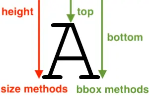

9.2.0
-----

Security
========

An additional decompression bomb check has been added for the GIF format.

Deprecations
============

PyQt5 and PySide2
^^^^^^^^^^^^^^^^^

.. deprecated:: 9.2.0

`Qt 5 reached end-of-life <https://www.qt.io/blog/qt-5.15-released>`_ on 2020-12-08 for
open-source users (and will reach EOL on 2023-12-08 for commercial licence holders).

Support for PyQt5 and PySide2 has been deprecated from ``ImageQt`` and will be removed
in Pillow 10 (2023-07-01). Upgrade to
`PyQt6 <https://www.riverbankcomputing.com/static/Docs/PyQt6/>`_ or
`PySide6 <https://doc.qt.io/qtforpython-6/>`_ instead.

FreeTypeFont.getmask2 fill parameter
^^^^^^^^^^^^^^^^^^^^^^^^^^^^^^^^^^^^

.. deprecated:: 9.2.0

The undocumented ``fill`` parameter of :py:meth:`.FreeTypeFont.getmask2`
has been deprecated and will be removed in Pillow 10 (2023-07-01).

PhotoImage.paste box parameter
^^^^^^^^^^^^^^^^^^^^^^^^^^^^^^

.. deprecated:: 9.2.0

The ``box`` parameter is unused. It will be removed in Pillow 10.0.0 (2023-07-01).

Image.coerce_e
^^^^^^^^^^^^^^

.. deprecated:: 9.2.0

This undocumented method has been deprecated and will be removed in Pillow 10
(2023-07-01).

Font size and offset methods
^^^^^^^^^^^^^^^^^^^^^^^^^^^^

.. deprecated:: 9.2.0

Several functions for computing the size and offset of rendered text
have been deprecated and will be removed in Pillow 10 (2023-07-01):

=============================================================== =============================================================================================================
Deprecated                                                      Use instead
=============================================================== =============================================================================================================
``FreeTypeFont.getsize()`` and ``FreeTypeFont.getoffset()``     :py:meth:`.FreeTypeFont.getbbox` and :py:meth:`.FreeTypeFont.getlength`
``FreeTypeFont.getsize_multiline()``                            :py:meth:`.ImageDraw.multiline_textbbox`
``ImageFont.getsize()``                                         :py:meth:`.ImageFont.getbbox` and :py:meth:`.ImageFont.getlength`
``TransposedFont.getsize()``                                    :py:meth:`.TransposedFont.getbbox` and :py:meth:`.TransposedFont.getlength`
``ImageDraw.textsize()`` and ``ImageDraw.multiline_textsize()`` :py:meth:`.ImageDraw.textbbox`, :py:meth:`.ImageDraw.textlength` and :py:meth:`.ImageDraw.multiline_textbbox`
``ImageDraw2.Draw.textsize()``                                  :py:meth:`.ImageDraw2.Draw.textbbox` and :py:meth:`.ImageDraw2.Draw.textlength`
=============================================================== =============================================================================================================

Previous code::

    from PIL import Image, ImageDraw, ImageFont

    font = ImageFont.truetype("Tests/fonts/FreeMono.ttf")
    width, height = font.getsize("Hello world")
    left, top = font.getoffset("Hello world")

    im = Image.new("RGB", (100, 100))
    draw = ImageDraw.Draw(im)
    width, height = draw.textsize("Hello world", font)

    width, height = font.getsize_multiline("Hello\nworld")
    width, height = draw.multiline_textsize("Hello\nworld", font)

Use instead::

    from PIL import Image, ImageDraw, ImageFont

    font = ImageFont.truetype("Tests/fonts/FreeMono.ttf")
    left, top, right, bottom = font.getbbox("Hello world")
    width, height = right - left, bottom - top

    im = Image.new("RGB", (100, 100))
    draw = ImageDraw.Draw(im)
    width = draw.textlength("Hello world", font)

    left, top, right, bottom = draw.multiline_textbbox((0, 0), "Hello\nworld", font)
    width, height = right - left, bottom - top

Previously, the ``size`` methods returned a ``height`` that included the vertical
offset of the text, while the new ``bbox`` methods distinguish this as a ``top``
offset.

 itself.
    :align: center

If you are using these methods for aligning text, consider using :ref:`text-anchors` instead
which avoid issues that can occur with non-English text or unusual fonts.
For example, instead of the following code::

    from PIL import Image, ImageDraw, ImageFont

    font = ImageFont.truetype("Tests/fonts/FreeMono.ttf")

    im = Image.new("RGB", (100, 100))
    draw = ImageDraw.Draw(im)
    width, height = draw.textsize("Hello world", font)
    x, y = (100 - width) / 2, (100 - height) / 2
    draw.text((x, y), "Hello world", font=font)

Use instead::

    from PIL import Image, ImageDraw, ImageFont

    font = ImageFont.truetype("Tests/fonts/FreeMono.ttf")

    im = Image.new("RGB", (100, 100))
    draw = ImageDraw.Draw(im)
    draw.text((100 / 2, 100 / 2), "Hello world", font=font, anchor="mm")

API additions
=============

Image.apply_transparency
^^^^^^^^^^^^^^^^^^^^^^^^

Added :py:meth:`~PIL.Image.Image.apply_transparency`, a method to take a P mode image
with "transparency" in ``im.info``, and apply the transparency to the palette instead.
The image's palette mode will become "RGBA", and "transparency" will be removed from
``im.info``.

Other changes
=============

Using gnome-screenshot on Linux
^^^^^^^^^^^^^^^^^^^^^^^^^^^^^^^

In :py:meth:`~PIL.ImageGrab.grab` on Linux, if ``xdisplay`` is ``None`` then
``gnome-screenshot`` will be used to capture the display if it is installed. To capture
the default X11 display instead, pass ``xdisplay=""``.
